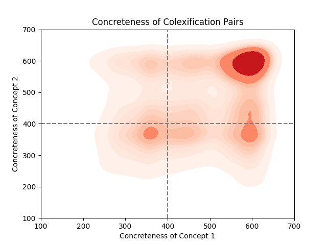
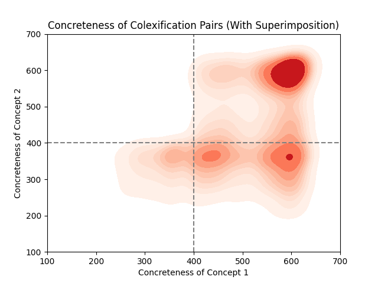

# Patterns in Abstract-Concrete Pairings in Colexification
*By Akunna Megwa and Tian Sirchich*

### Project Topic and Hypothesis
**Topic:** The concreteness of concepts and its relationship with colexification.

**Hypothesis:** Abstract concepts are more likely to be colexified with concrete concepts than with other abstract concepts. The motivation behind this hypothesis is rooted in the observation that metaphor usage in English often employs concrete labels to convey complex meanings about abstract concepts. Concrete concepts are posited to be more straightforward to understand, and colexifying them with abstract concepts may facilitate better comprehension of the latter.

## Research Motivation

The motivation behind our hypothesis lies in the potential relationship between concreteness and colexification, driven by the following considerations:

1. **Metaphorical Usage in English:**
   - The observation that metaphor usage in English frequently leverages concrete labels to convey nuanced meanings about abstract concepts is a pivotal motivation. This phenomenon implies a potential link between concreteness and colexification.

2. **Ease of Comprehension:**
   - Concrete concepts are generally considered more accessible and easier to understand compared to abstract concepts. By colexifying abstract concepts with concrete ones, we anticipate that the resulting pairs may facilitate improved comprehension of the abstract concept.

3. **Communication Complexity:**
   - Abstract concepts often involve intricate and complex ideas that may be challenging to express directly. Utilizing concrete concepts in colexification could serve as a communication strategy to simplify the representation of abstract notions.

4. **Cognitive Processing:**
   - Exploring the hypothesis is motivated by the idea that cognitive processes underlying colexification may involve patterns that align with the cognitive mechanisms involved in metaphorical thinking. This prompts us to delve deeper into understanding the cognitive underpinnings of concreteness and colexification.

In summary, our motivation is rooted in the intricate interplay between the concreteness of concepts and the ways in which they are colexified. This exploration seeks to uncover underlying patterns that contribute to a richer understanding of language structure and conceptual relationships.

## CLICS Dataset Overview

### Introduction
The Cross-Linguistic Colexifications (CLICS) dataset serves as a crucial resource for our project, offering a comprehensive collection of linguistic colexification patterns across diverse languages. This dataset is instrumental in our exploration of the relationship between concreteness and colexification in the realm of abstract and concrete concepts.

### Key Features of the CLICS Dataset
1. **Colexification Patterns:**
   - CLICS contains information on colexification patterns, indicating instances where two or more concepts are expressed by a shared linguistic form within a language. This allows us to analyze how abstract and concrete concepts co-occur across different linguistic communities.

2. **Geographical and Genealogical Information:**
   - Each entry in CLICS is associated with geographical and genealogical metadata, providing insights into the distribution of colexification patterns among languages. This information is essential for understanding regional and genetic influences on linguistic structures.

3. **Semantic Domains:**
   - CLICS organizes colexifications into semantic domains, categorizing related concepts. This hierarchical organization facilitates a more nuanced exploration of colexification patterns within specific thematic areas.

4. **Frequency Metrics:**
   - The dataset includes frequency metrics, indicating the prevalence of colexification patterns across languages. This information aids in identifying prominent colexifications and understanding their linguistic significance.

### Utilization in Our Project
Our project leverages the CLICS dataset to investigate the directional relationship between concreteness and colexification. By extracting relevant information on abstract and concrete concepts colexified within languages, we aim to uncover patterns that shed light on the conceptual structuring of linguistic expressions.

### Data Preprocessing
To align the CLICS dataset with our research objectives, we performed targeted data preprocessing steps. This involved categorizing concepts based on concreteness and creating predictor-outcome pairs for subsequent statistical analyses.

### Significance in Linguistic Research
CLICS stands as a valuable resource in the field of linguistic typology, providing a cross-linguistic perspective on colexification patterns. Its extensive coverage of languages and semantic domains makes it a suitable foundation for projects exploring the relationships between different linguistic and conceptual dimensions.

## Results

### Concreteness Categorization
The initial step in our analysis involved categorizing concepts based on concreteness within colexified pairs. We classified concepts as either abstract (<= 400) or concrete (> 400), forming the basis for subsequent investigations.

#### Overall Distribution
The analysis of concreteness categorization within colexified pairs revealed the following distribution:

- **Abstract-Abstract Pairs:** 14.93%
- **Concrete-Abstract Pairs:** 21.64%
- **Concrete-Concrete Pairs:** 63.43%

This distribution, aggregated across diverse language varieties, provides an initial glimpse into the prevalence of different concreteness combinations. Please refer to the density map below for a visual representation of this.

Note that quadrant II and quandrant IV both represent cross-concreteness colexification. Since the order of the pairs is irrelevant to our findings the two quadrants may be combined as such:

The basis of our research is to see if there is a significant difference between quadrant IV and quadrant III in the density map above.
### Statistical Analysis

#### Chi-Square Test
- **Null Hypothesis:** The category of the first concept in a colexified pair has no effect on the category of the second concept.
- **Results:** The Chi-Square test yielded a p-value of 0.0, strongly rejecting the null hypothesis. This indicates a significant dependency between the concreteness scores of the first and second concepts in colexified pairs.

#### Logistic Regression Models
We employed logistic regression models to test the hypothesis regarding the directionality of the relationship between concreteness and colexification.

##### Abstract-Concrete Pairs
- **Null Hypothesis:** The odds of the presence of a concrete variable in a colexified pair are not affected by the presence of an abstract concept.
- **Results:** The p-value from the logistic regression was 9.598e-135, leading to the rejection of the null hypothesis. This suggests that the presence of an abstract concept in a colexified pair significantly increases the odds of the other concept being concrete.

##### Concrete-Abstract Pairs
- **Null Hypothesis:** The odds of the presence of an abstract variable in a colexified pair are not affected by the presence of a concrete concept.
- **Results:** The p-value mirrored the abstract-concrete pair, reinforcing the rejection of the null hypothesis. This indicates that the presence of a concrete concept in a colexified pair significantly increases the odds of the other concept being abstract.

### Conclusion and Implications

#### Relationship Between Concreteness and Colexification
Our results provide robust evidence supporting a directional relationship between concreteness and colexification. The Chi-Square test and logistic regression analyses consistently reject the null hypotheses, indicating a significant dependency and influencing effect between the concreteness scores of concepts within colexified pairs.

#### Implications for Linguistic Typology
These findings contribute to the broader field of linguistic typology by uncovering patterns in how abstract and concrete concepts are linguistically interconnected across diverse languages. The observed relationships may reflect cognitive and cultural influences on linguistic structures.

### Future Directions

#### Further Investigation
While our results provide valuable insights, further investigation is warranted. Future research should explore the underlying mechanisms and cognitive processes that contribute to the observed relationships. Additionally, examining specific linguistic and cultural contexts may offer a more nuanced understanding of concreteness and colexification.

**In summary, our results affirm a significant relationship between concreteness and colexification, marking a crucial step towards unraveling the intricate connections within linguistic typology.**

### Acknowledgments and Questions
Thank you for your attention! Any questions or suggestions for further exploration are welcomed. We would like to acknowledge Jai Aggarwal and Yang Xu, our TA and professor from COG260 at the University of Toronto where this project first began.

---
